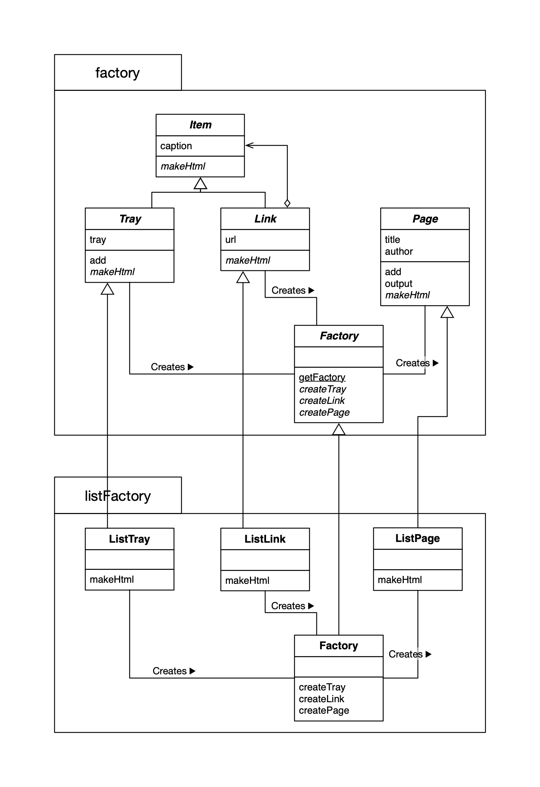
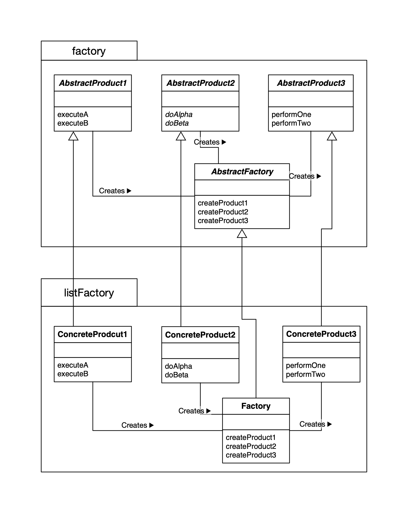

## Abstract Factory Design Pattern

**抽象工厂的工作是将“抽象零件”组装为“抽象产品”。我们不关心零件的具体实现，而是只关心接口（API）。我们仅使用该接口（API）将零件组装称为产品**

### 抽象工程模式例子 UML

### 抽象工厂模式 UML

### Adapter 模式中的角色

- `AbstractProduct` 抽象产品，负责定义 AbstractFactory 角色所生成抽象零件的产品的接口（API）。
- `AbstractFactory` 抽象工厂，负责定义用于生成抽象产品的接口（API）。
- `Client` 委托者，调用 AbstractFactory 角色和 AbstractProduct 角色的接口（API）来进行工作，对具体的零件、产品和工厂一无所知。
- `ConcreteProduct` 具体产品，负责实现抽象产品的接口（API）。
- `ConcreteFactory` 具体工厂，负责实现抽象工厂的接口（API）。

### 思考

易于增加具体的工厂：增加具体的工厂，无需修改抽象工厂和 Main 的部分。

#### 为什么不用 `new` 生成实例？

因为这样就出现了具体实例的名称。

#### clone

使用 clone 复制出一个新的实例，不会调用构造函数。

#### newInstance

`java.lang.Class`类的 `newInstance`方法可以通过 Class 累的实例生成出 Class 类所表示的类，会调用无参构造函数。

