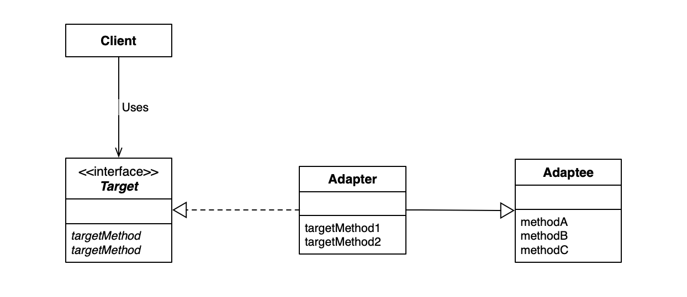
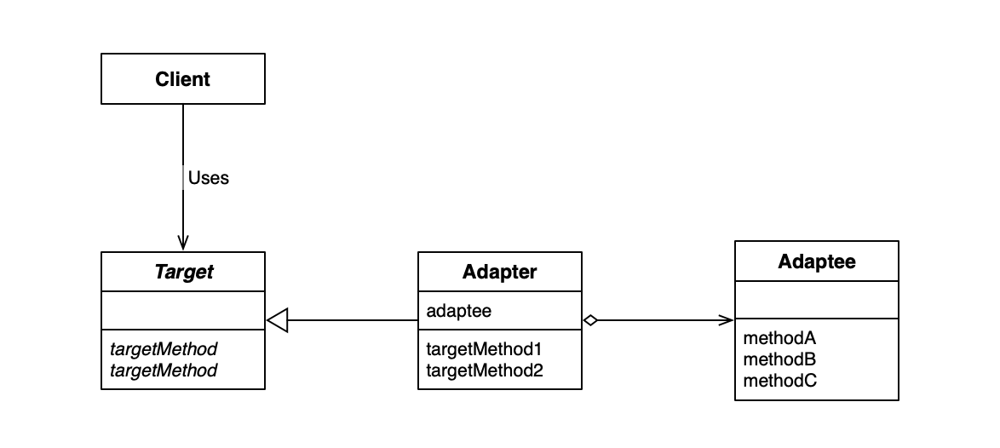
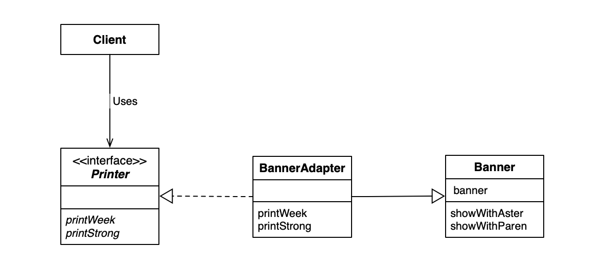
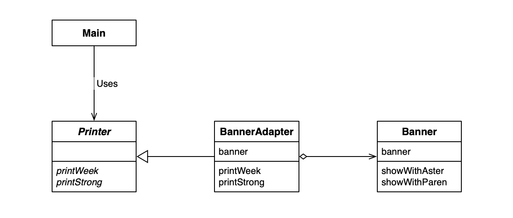

## Adapter Design Pattern

Adapter 模式有两种实现方式：
1. 类适配器模式 （使用继承的适配器）
2. 对象适配器模式 （使用委托的适配器）

### 类适配模式（使用继承的适配器）UML

### 对象适配器模式（使用委托的适配器）UML

### 类适配模式（使用继承的适配器）例子 UML

### 对象适配器模式（使用委托的适配器）例子 UML

### 委托

继承是子类拥有父类方法，本身拥有需要调用的方法。委托则是拥有即将使用方法的对象，通过该对象调用。本例中，在 `Main` 调用了 `BannerPrinter` 的方法，事实上只是一种委托关系，委托 `BannerPrinter` 调用 `Banner` 的方法。

### Adapter 模式中的角色

- `Target` 对象，该角色负责定义所需的方法。
- `Client` 请求者，该角色使用 Target 角色调用相应的方法。
- `Adapter` 适配器
- `Adaptee` 被适配的对象

### 为什么要使用 Adapter 模式？

- 面对已有代码。多数时候我们不是从0开始编程，特别是现有类被充分测试过，而且已经用在其他软件中，这时候适配器可以帮助我们更好的复用这些组件。当出现问题时，我们知道问题不是出现在已经充分测试过的 `Adaptee` 类中，而是 `Adapter` 。
- 没有现成代码。我们让类适配新的接口（ `API` ）时，常常会有对现有类稍作修改的情况，修改了现有类会导致我们测试通过的代码，需要重新测试。使用 `Adapter` 模式可以在完全不改变现有代码的前提下，使现有代码适配新的接口（ `API` ） 。
- 版本升级和兼容性。我们在新版本发布的同时，有时候需要兼容旧版本，使用 Adapter 可以轻松做到这一点。

### 思考

为什么在 `Main` 中，使用了 `Printer printer = new BannerPrinter("Hello");` ，而不是 `BannerPrinter printer = new BannerPrinter("Hello");` ？

因为 `BannerPrinter` 可能实现了多余 `Printer` 的方法，让变量保存在 `Printer` 对象中，更可以体现**程序的意图**。