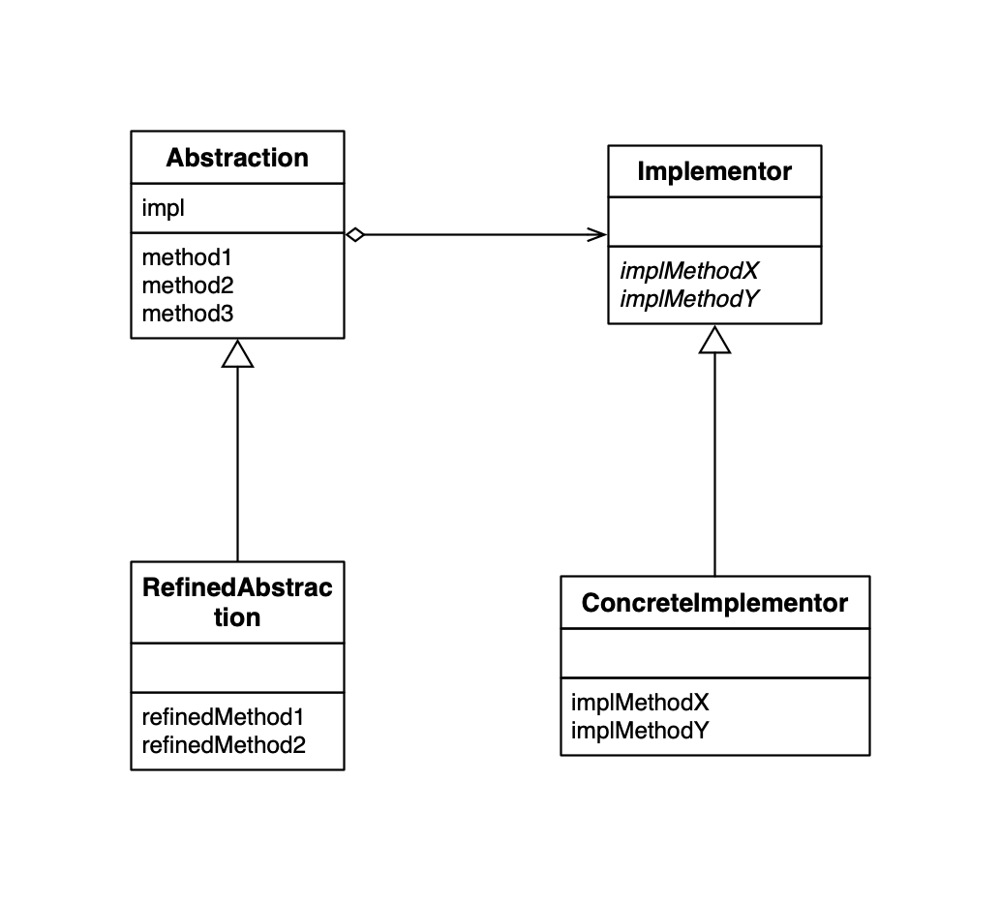

## Bridge Pattern

Bridge 模式的主要是为了**将两样东西连接起来**，分别是：

1. **类的功能层次结构**：父类具有基本功能，在子类中增加新的功能。
2. **类的实现层次结构**：父类通过声明抽象爱过你方法来定义接口（API），子类通过实现具体方法来实现接口（API）。

当我们编写子类时，需要先确认自己的意图：增加功能还是增加实现。当类的层次结构只有一层时，功能层次结构与实现层次结构是混杂在一个层次结构中的。这样很容易使类的层次结构变的复杂，也难以透彻地理解类的层次结构，自己难以确定究竟应该在类的哪一个层次结构中增加子类。

所以我们需要将“类的功能层次结构”与“类的实现层次结构”**分离未两个独立的类层次结构**。如果只是简单的分开，两者之间必然会缺少联系，所以我们需要在它们之间搭建桥梁，就是 bridge 模式。

### Bridge 模式 UML

### Bridge 模式例子 UML

### 类的一览表

| 在类的哪一侧     | 名字                                          | 说明                           |
| ---------------- | --------------------------------------------- | ------------------------------ |
| 类的功能层次结构 | [Display](./Display.java)                     | 负责“显示”的类                 |
| 类的功能层次结构 | [CountDislay](./CountDisplay.java)            | 增加了“只显示规定次数”这一功能 |
| 类的实现层次结构 | [DisplayImpl](./DisplayImpl.java)             | 负责显示的类                   |
| 类的实现层次结构 | [StringDisplayImpl](./StringDisplayImpl.java) | 使用字符串显示的类             |
|                  | [Main](./Main.java)                           | 测试程序行为的类               |

### Bridge 模式中的角色

- `Abstraction` 抽象化，该角色位于“类功能层次的最上层”。
- `RefinedAbstraction`改善后的抽象画，在 `Abstraction` 角色的基础上增加了新功能的角色。
- `Implementor` 实现者。
- `ConcreteImplementor` 具体的实现者。

### 为什么要使用 Bridge 模式？

**分开后更容易扩展。**当想要增加功能时只需要在**类的功能层次结构**一侧增加类即可，不必对**类的实现层次结构**做任何修改。**增加后的功能可以被“所有的实现”使用。**

例如：可以将“类的功能层次结构”应用于软件所运行的操作系统上，将某个程序以来操作系统的部分划分为windows版、Mac版、Unix版，我们就可以用Bridge模式中的“类实现层次结构”来表现这些依赖于操作系统的部分。也就是说，我们需要编写一个定义这些操作系统的共同接口（API）的Implementor角色，然后编写不同版本的ConcreteImplementor角色。这样无论“类的功能层次结构”中增加多少个功能，它们都可以工作于这3个操作系统上。

### 继承是强关联，委托是弱关联

虽然使用“继承”很容易扩展类，但是类之间也形成了一种强关联关系。在使用委托时，类的任务就发生了转移。