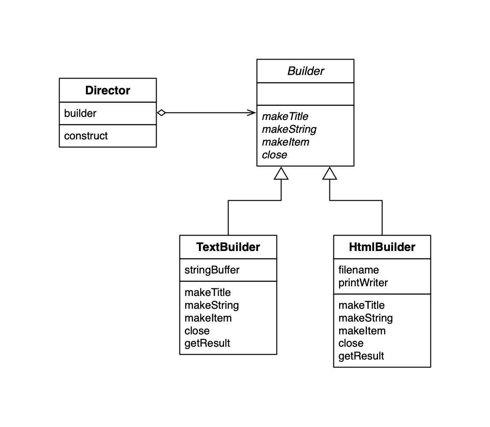
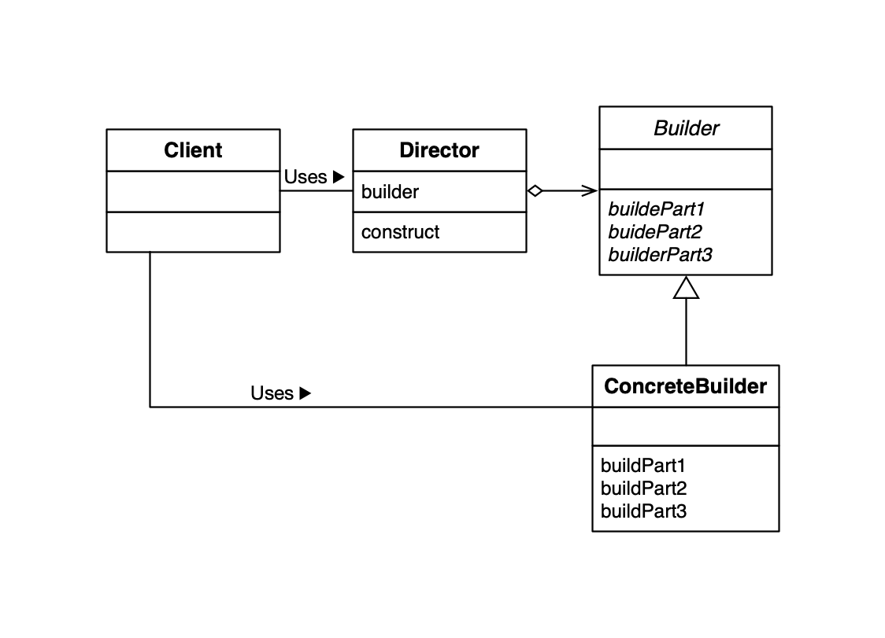

## Builder Design Pattern

## 组装复杂的实例

### 类的一览表

| 名字                              | 说明                            |
| --------------------------------- | ------------------------------- |
| [Builder](./Builder.java)         | 定义了决定文档结构的方法的抽象类   |
| [Director](./Director.java)       | 编写一个文档类 |
| [TextBuilder](./TextBuilder.java) | 使用纯文本编写文档  |
| [HtmlBuilder](./HtmlBuilder.java) | 使用HTML编写文档的类 |
| [Main](./Main.java)               | 测试程序行为的类                |

### Builder Method 例子 UML

### Factory Method UML

### Builder 模式中的角色

- `Builder`（建造者）
- `ConcreteBuilder` （具体的建造者）
- `Director`（监工）：使用 `Builder` 角色的接口来生成实例。
- `Client`（使用者）：在GoF书中并不包含该角色。

### 谁知道什么

Director 并不知道自己使用的是 Builder 的哪一个子类，因为：**只有不知道子类才能替换。**正因为可替换，组件才有高价值。作为设计人员，我们必须关注这种**可替换性** 。