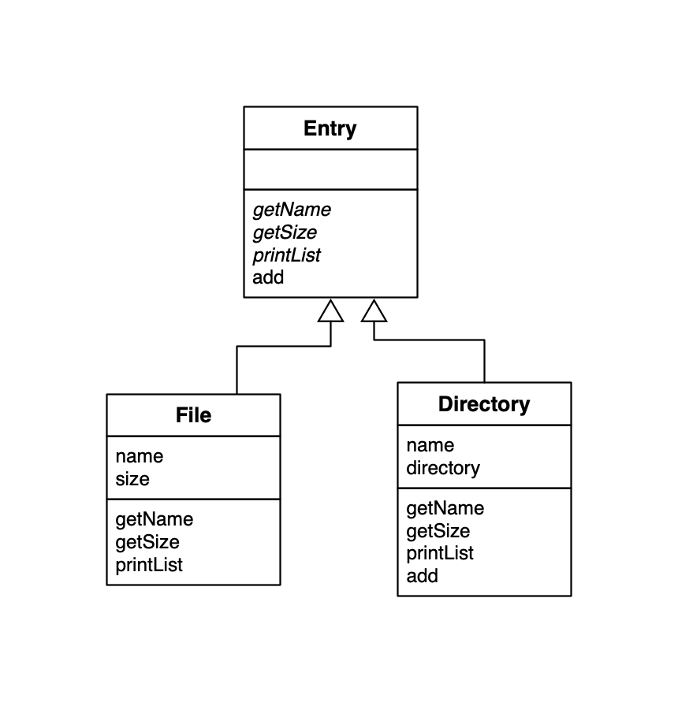
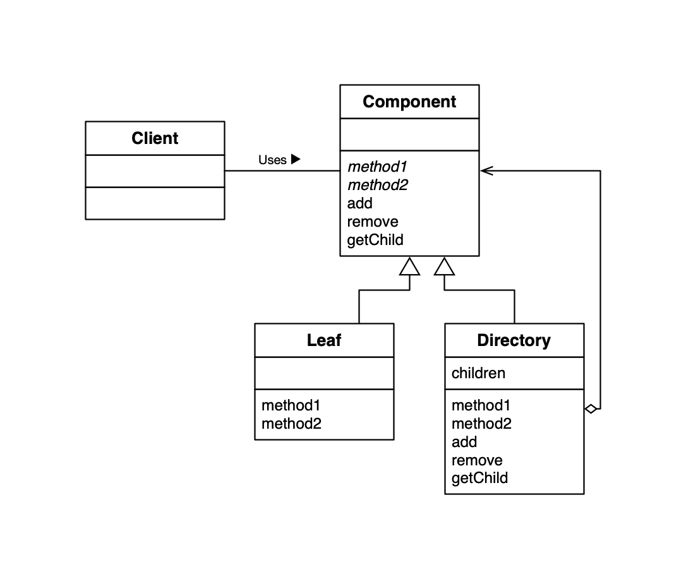

## Composite Design Pattern

**能够使容器与内容具有一致性，创造出递归结构的模式就是 Composite 模式。**

比如：文件夹与文件都作为目录条目看待，将容器和内容作为同一种东西看待，可以帮助我们方便地处理问题。容器中可以放入容器，这样就形成了容器结构、递归结构。

### Composite 例子 UML

### 类的一览表

| 名字                                                    | 说明                            |
| ------------------------------------------------------- | ------------------------------- |
| [Entry](./Entry.java)                                   | 抽象类，用来实现 File 类 和 Directory 类的一致性   |
| [Directory](./Directory.java)                           | 表示文件夹的类 |
| [File](./File.java)                                     | 表示文件的类         |
| [FileTreatmentException](./FileTreatmentException.java) | 表示向文件中增加Entry时发生异常的类 |
| [Main](./Main.java)                                     | 测试程序行为的类                |

### Composite UML

### Factory Method 模式中的角色

- `Leaf`（树叶）表示“内容”的角色，该角色不能放入其他对象。
- `Composite` （复合物）：表示容器的角色，可以在其中放入 Leaf 和 Composite 角色。
- `Component` ：使Leaf和Composite角色具有一致性的角色。
- `Client` ：使用者角色

### 思考

**使用Composite模式可以使容器与内容具有一致性，也可以称为多个和单个的一致性。**