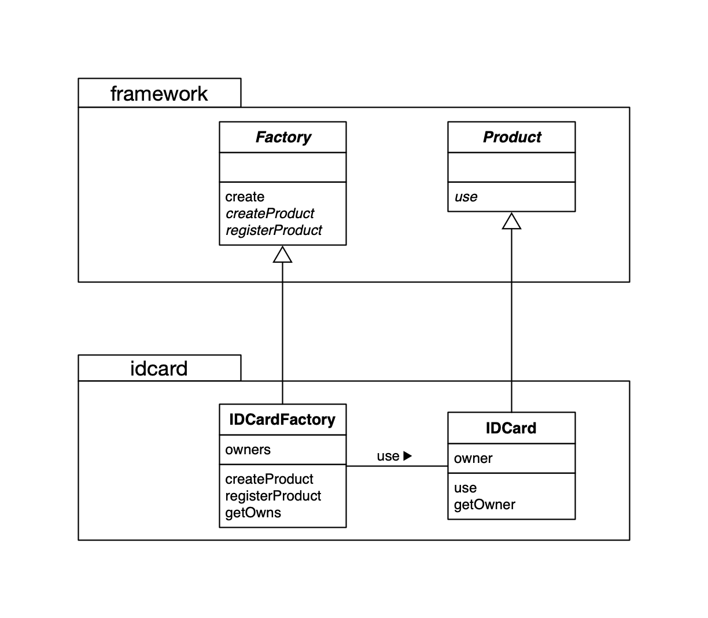
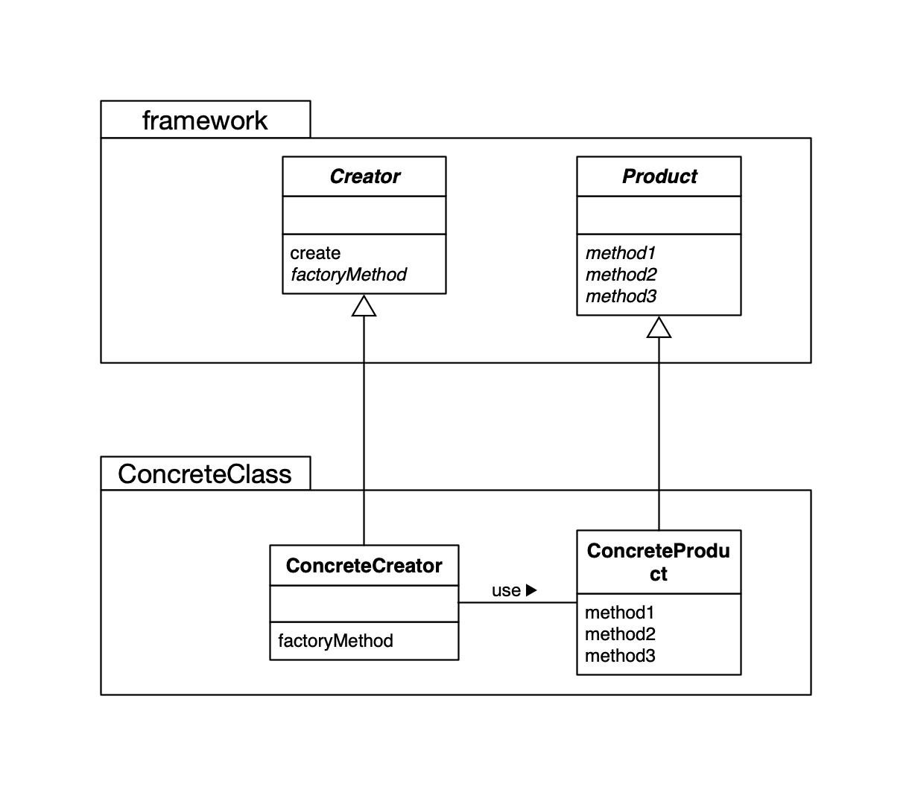

## Factory Method Design Pattern

在 Factory Method 中，**父类决定实例的生成方式，但不决定所要生成的具体类**，具体的处理全部交给子类负责。


### Factory Method 例子 UML



### 类的一览表

| 包        | 名字                                         | 说明                            |
| --------- | -------------------------------------------- | ------------------------------- |
| framework | [Product](./framework/Product.java)          | 只定义了抽象方法 use 的抽象类   |
| framework | [Factory](./framework/Factory.java)          | 实现了 create 方法的抽象类      |
| idcard    | [IDCard](./idcard/IDCard.java)               | 实现了 use 方法的类             |
| idcard    | [IDCardFactory](./idcard/IDCardFactory.java) | 实现了 Factory 另外两个方法的类 |
|           | [Main](./Main.java)                          | 测试程序行为的类                |


### Factory Method UML



### Factory Method 模式中的角色

- `Product`（产品）
- `Creator` （创建者）：**不用 `new` 关键字来生成实例，而是调用生成实例专用的方法来生成实例，这样就可以放置父类与其他具体类耦合。**
- `ConcreteProduct` （具体的产品）
- `ConcreteCreator` （具体的创建者）

### 思考

**1. 在分析设计模式时，不应当将其中一个类单独拿出来分析，必须着眼于类和接口之间的相互关系。**

2. 为什么下面代码会编译错误？

   ```java
   public abstract class Product {
       public abstract Product(String name);
       public abstract void use();
   }
   ```

   答： Java 中构造函数是不会被继承的，因此定义 abstract 的构造函数没有意义。**在 Java 中无法定义 abstract 的构造函数。**