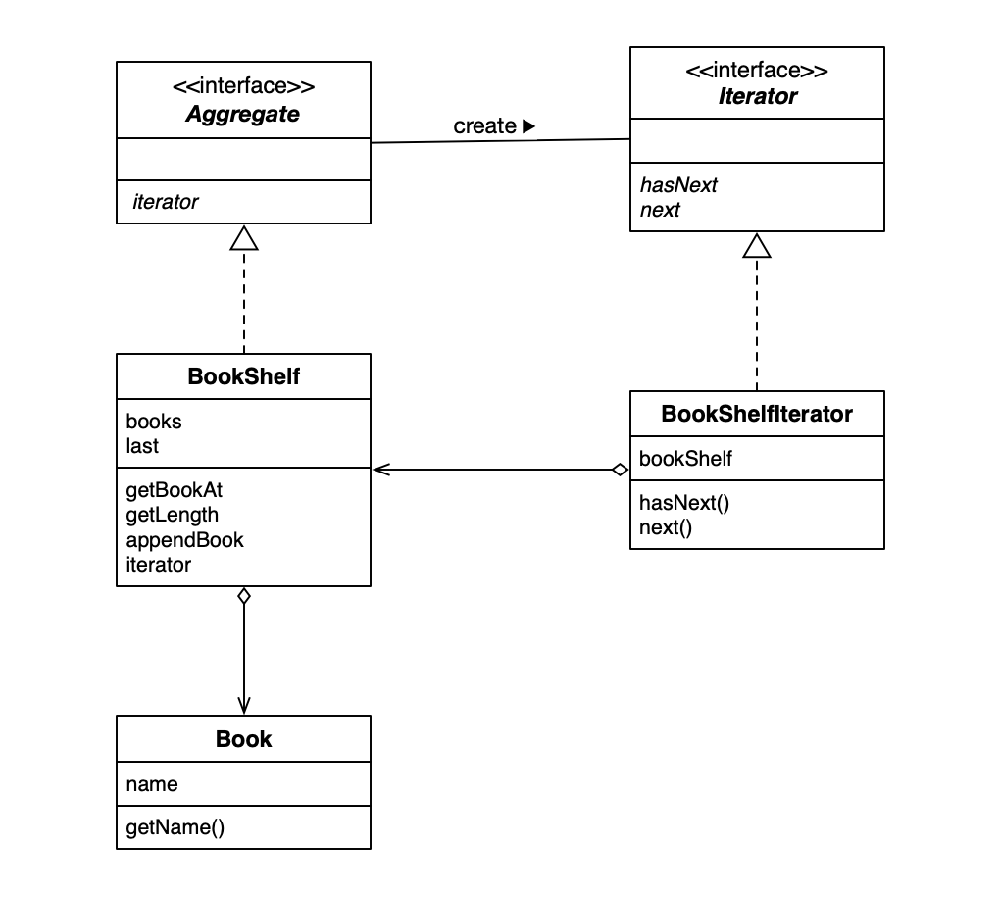
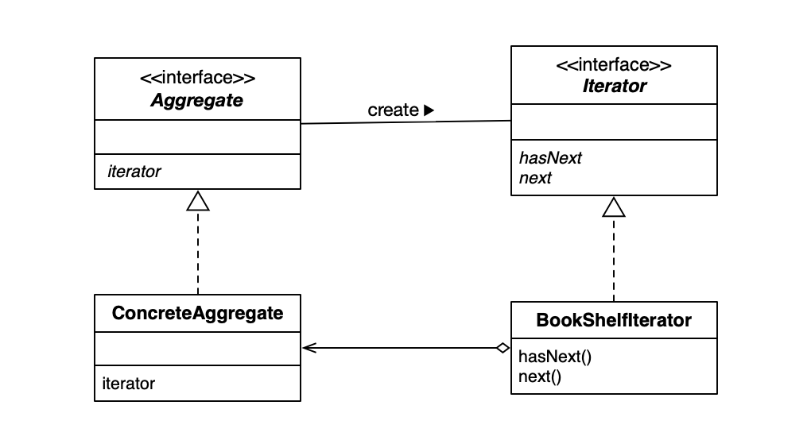

## Iterator Design Pattern

### 类和接口一览表

| 名字                                          | 说明             |
| --------------------------------------------- | ---------------- |
| [Aggregate](./Aggregate.java)                 | 表示集合的接口   |
| [Iterator](./Iterator.java)                   | 遍历集合的接口   |
| [Book](./Book.java)                           | 表示书的类       |
| [BookShelf](./BookShelf.java)                 | 表示书架的类     |
| [BookShelfIterator](./BookShelfIterator.java) | 遍历书架的类     |
| [Main](./Main.java)                           | 测试程序行为的类 |

### Example UML



### Design Pattern UML



### Iterator 模式中的角色

- `Iterator` 迭代器
- `ConcreteIterator` 具体的迭代器
- `Aggregate` 集合
- `ConcreteAggregate` 具体的集合

### 为什么要使用 Iterator 模式？

**引入 `Iterator` 后可以将实现和遍历分离开来**，如下面的代码：

```java
Iterator bookIterator = bookShelf.iterator();
while (bookIterator.hasNext())
    System.out.println(((Book)bookIterator.next()).getName());
```

上面的循环调用了 `Iterator` 的 `hasNext()` 方法和 `next()` 方法，并未使用 `BookShelf` 类的任何方法，解耦了书架类的实现和遍历。如果 `BookShelf` 类的开发人员不再使用数组存放 `Book` ，而是使用 `Vector` ，我们只需要修改 `BookShelf` 类的 `Iterator` 即可，遍历相关的代码完全不需要任何修改。

### 抽象类和接口

如果只用具体的类来解决问题，很容易导致类之间的强耦合，这些类也难以作为组件被再次利用。为了弱化类之间的耦合，梗容易作为组件被再次利用，我们需要引入抽象类和接口。
印在脑海中：**不要只是用具体类来变编程，要优先使用抽象类和接口来编程。**

### 注意不要弄错的地方

`next()` 方法返回的是当前元素还是下一个？当前。
`hasNext()` 方法理解成“接下来是否可以调用 `next()` 方法”的方法。

### 多种多样的迭代器

- 从最后往前遍历
- 既可以从前向后遍历，也可以从后往前遍历 （既有 `next()` 方法又有 `previous()` 方法）
- 指定下标进行“跳跃式”遍历

