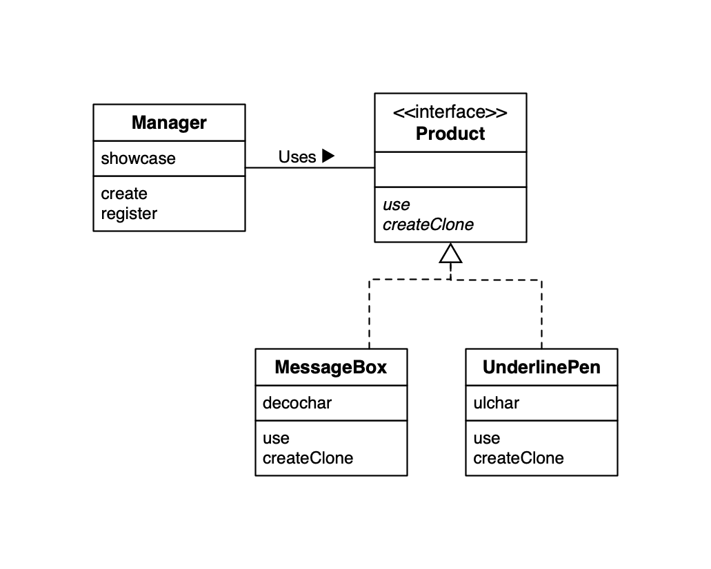
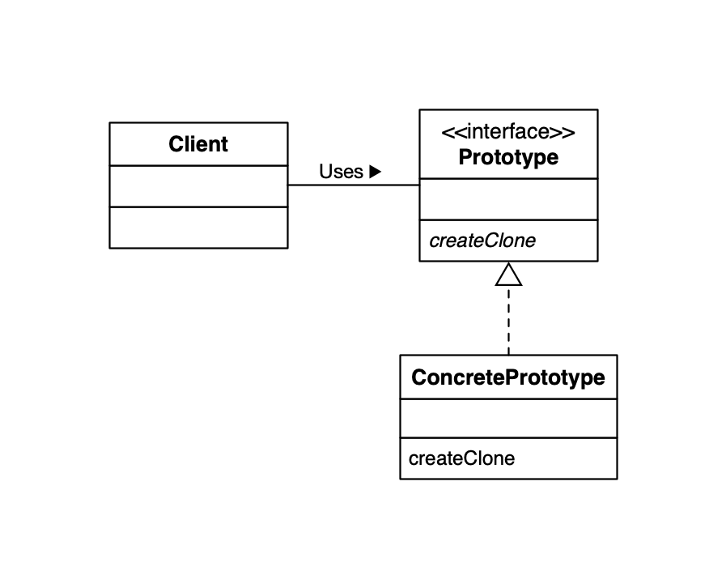

## Prototype Design Pattern

### 类和接口一览表

| 包        | 名字                                | 说明                                         |
| --------- | ----------------------------------- | -------------------------------------------- |
| framework | [Product](./framework/Product.java) | 声明了抽象方法 `use` 和 `createClone` 的接口 |
| framework | [Manager](./framework/Manager.java) | 调用 `createClone` 方法复制实例的类          |
|           | [UnderlinePen](./UnderlinePen.java) | 实现 `use` 和 `createClone` 方法的具体类     |
|           | [MessageBox](./MessageBox.java)     | 实现 `use` 和 `createClone` 方法的具体类     |
|           | [Main](./Main.java)                 | 测试程序行为的类                             |

### Example UML

### Design Pattern UML

### Iterator 模式中的角色

- `Prototype` 原型：定义用于复制现有实例生成新实例的方法。
- `ConcretePrototype` 具体的原型：负责实现复制现在实例并生成新实例的方法。
- `Client` 使用者：负责使用复制实例的方法生成新的实例。

### 为什么要使用 Prototype 模式？

1. 对象种类繁多，无法将它们整合到同一个类中。
2. 难以根据类生成实例。
3. 想解耦框架和生成的实例时。

### 类名是束缚吗？

一代代码中出现要使用类的名字，就无法与该类分离开来，也就无法实现复用。

### 关于 `clone` 方法 和 `java.lang.Clonable` 接口

想要调用 `clone` 方法，被复制对象的类必须实现 `java.lang.Clonable` 接口。

实现了 `Clonable` 接口的类的实例可以调用 clone 方法进行复制，`clone` 方法的返回值是复制出的新的实例（`clone` 方法内部所进行是分配与要复制的实例同样大小的内存空间，接着将要复制的实例中的字段的值复制到所分配的内存空间中去）。

### clone 方法是在哪里定义的

`clone` 方法定义在 `java.lang.Object` 中。因为 `Object` 类是所有 `Java` 类的父类，因此所有的 `Java` 类都继承了 `clone` 方法。

### 需要实现 Clonable 的那些方法

`Clonable` 接口中并没有声明任何方法，它只是被用来标记“可以使用 `clone` 方法进行复制”的，这样的接口被称为**标记接口**。

### clone 方法进行的是浅复制

`clone` 方法所进行的复制只是将被复制实例的字段值直接复制到新的实例中，换言之，它并没有考虑到字段中所保存的实例的内容。如字段中保存的是数组，`clone` 方法只复制了该数组的引用，并没有一一复制数据中的元素。

当时使用 `clone` 潜复制无法满足要求时，可以实现重写 `clone` 方法（别忘了使用 `super.clone()` 调用父类的 `clone` 方法）。

需要注意的是 `clone` 只会复制，不会调用构造函数。

### 问题

例子中 MessageBox 类和 UnderlinePen 类中 createClone 方法实现完全相同，这并不是一个好的设计，请思考解决方法。

1. 可以写一个实现了 createClone 方法的父类，让两者继承该父类。
2. 改写 Product 接口为一个抽象类，并实现 createClone 方法。