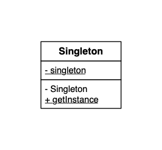

## Singleton Design Pattern

**Singleton 的主要目标在于，确保在任何情况下都绝对只有一个实例。**

### 类和接口一览表

| 名字                                          | 说明             |
| --------------------------------------------- | ---------------- |
| [Singleton](./Singleton.java)                 | 只存在一个实例的类   |
| [Main](./Main.java)                           | 测试程序行为的类 |

### Example UML and Design Pattern UML (Same UML)

### Singleton 模式中的角色

- `Singleton` Singleton 有返回唯一一个实例的 `static` 方法。

### 为什么要使用 Singleton 模式？

某些情况下多个实例会产生意想不到的 `Bug` ，所以要求只使用一个实例来完成某些任务。

### 注意

- 构造方法为 `private` ，可以避免对象被 `new` 出来。
- 

