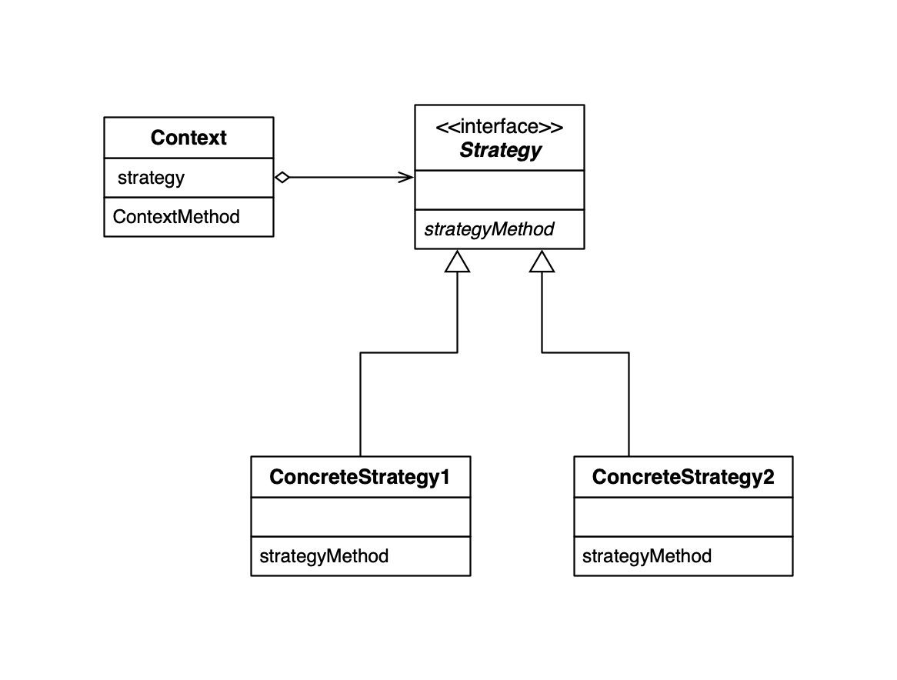
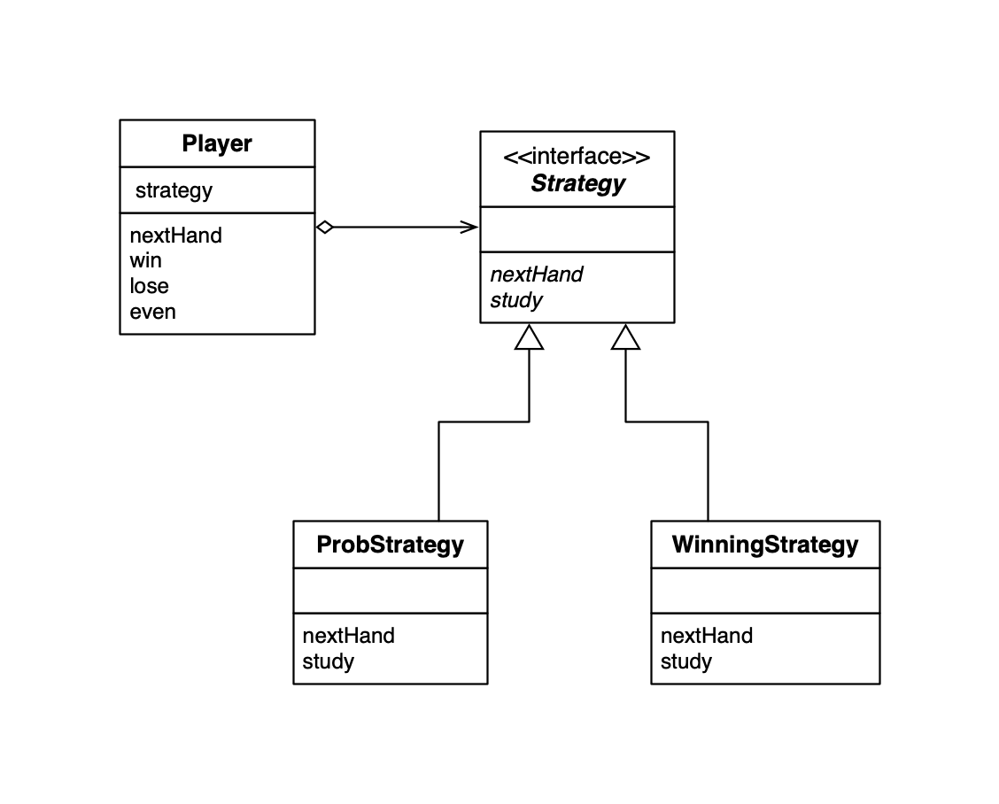

## Strategy Pattern

**整体的替换算法**

使用 Strategy 模式可以整体地替换算法，能让我们轻松地以不同的算法解决同一个问题。

### Bridge 模式 UML

### Bridge 模式例子 UML

### 类的一览表

| 名字                                      | 说明                                                         |
| ----------------------------------------- | ------------------------------------------------------------ |
| [Hand](./Hand.java)                       | 猜拳手势类                                                   |
| [Strategy](./Strategy.java)               | 表示猜拳策略的类                                             |
| [WinningStrategy](./WinningStrategy.java) | 表示“如果这局获胜，下局出同样手势”这一策略的类。             |
| [ProbStrategy](./ProbStrategy.java)       | 表示“根据上一局的手势从概率上计算出下一局的手势从之前的猜拳结果计算下一局各种拳的概率”这一策略的类 |
| [Player](./Player.java)                   | 表示进行猜拳游戏的选手的类                                   |
| [Main](./Main.java)                       | 测试程序行为的类                                             |

### Strategy 模式中的角色

- `Strategy` 策略，该角色负责定义实现策略类所必须的接口（API）。
- `ConcreteStrategy` 具体的策略，负责实现 Strategy 角色的接口（API），即负责实现具体的策略（战略、方向和算法）。
- `Context` 上下文，该角色中保存了 Strategy 角色的实例，并使用它去实现需求。为什么要使用 Bridge 模式？

### 为什么需要编写 Strategy 角色

如果我们想通过改善算法来提高算法的处理速度时，如果使用了Strategy模式，就不必修改Strategy角色的接口（API）了，仅仅修改ConcreteStrategy角色即可。而且，**使用委托这种弱关联关系可以很方便的整体替换算法**。

