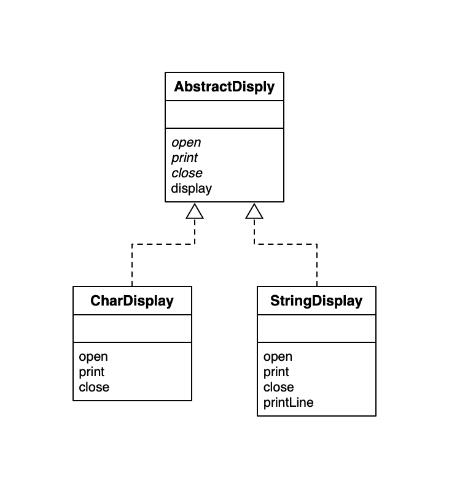
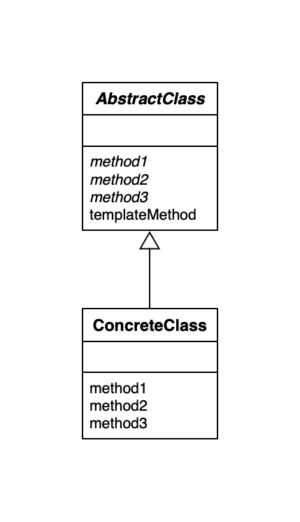

## Template Method Design Pattern

在父类中定义框架流程，在子类中实现的模式就是 `Template Method` 模式。

**重点：`Template Method` 最核心的地方在于：在抽象类阶段确定处理的流程。这个流程在这个模式中的表现为 `templateMethod()` 方法。**

### Template Method 例子 UML

### Template Method UML

### Template Method 模式中的角色

- `AbstractClass` 抽象类，不仅定义了模板方法，还定义了模板方法使用的抽象方法。**通常情况下，模板方法是不可修改的，所以用 `final` 关键字修饰。**
- `ConcreteClass` 具体类，实现抽象类定义的抽象方法。

### 为什么要使用 Adapter 模式？

可以使逻辑处理通用化。父类定义好逻辑处理方式，子类就不用再多次重复实现，复用即可。

### 父类对子类的要求

我们在理解类的层次时，通常站在子类的角度，我们会看到：

- 在子类中可以复用父类的方法。
- 子类可以增加新的方法，实现新的功能。
- 子类重写父类方法改变程序行为。

然而，在抽象的父类中，我们编写的抽象方法可以达到以下目的：

- 期待子类实现抽象方法。
- 要求子类实现抽象方法。

子类具有实现父类抽象方法的责任，通常也称 **子类责任（subclass responsibility）** 。

