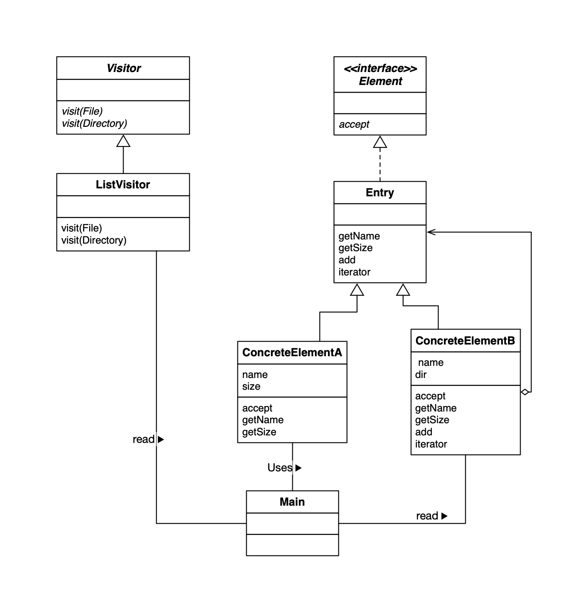
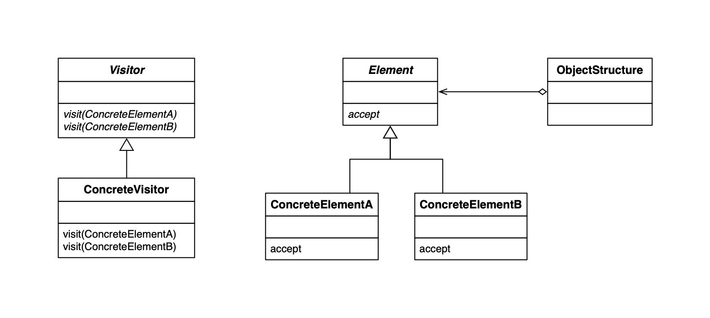

## Visitor Design Pattern

**访问数据结构并处理数据**

在 Visitor 模式中，数据结构与处理分离开来。我们编写一个表示“访问者”的类来访问数据结构中的元素，并把对各元素的处理交给访问者类。这样，当需要增加新的处理时，我们只需要编写新的访问者，然后让数据结构接受访问者的访问即可。

### Template Method 例子 UML

### 类的一览表

| 名字                                                    | 说明                                                         |
| ------------------------------------------------------- | ------------------------------------------------------------ |
| [Visitor](./Visitor.java)                               | 表示访问者的抽象类，它访问文件夹和文件                       |
| [Element](./Element.java)                               | 表示数据结构的接口，它接受访问者的访问                       |
| [ListVisitor](./ListVisitor.java)                       | Visitor 的子类，显示文件和文件夹一览                         |
| [Entry](./Entry.java)                                   | File 类 和 Directory 类的父类，它是抽象类（实现了Element 接口） |
| [File](./File.java)                                     | 表示文件的类                                                 |
| [Directory](./Directory.java)                           | 表示文件夹的类                                               |
| [FileTreatmentException](./FileTreatmentException.java) | 文件调用 add 添加的异常类                                    |
| [Main](./Main.java)                                     | 测试程序行为的类                                             |

### Template Method UML

### Template Method 模式中的角色

- `Visitor` 访问者，负责对数据结构中每个具体元素(ConcreteElement)生命一个用于访问 XXX 的 visit(XXX) 方法。
- `ConcreteVisitor` 具体的访问者，出了负责实现 Visitor 定义的方法，还要注意如示例中 currentdir 字段值不断发生变化，ConcreteVisitor 角色内部状态也会不断地发生变化。
- `Element` 元素，Element 角色表示 Visitor 角色的访问对象。它生命了接受访问者的 accept 方法，accept 接受到的参数是 Visitor 角色。
- `ConcreteElement` 
- `ObjectStructure` 对象结构，ObjectStructure 角色负责处理 Element 角色的集合。ConcreteVisitor 角色为每个Element 角色都准备了处理方法。在示例程序中，由 Directory 类扮演此角色（一人分饰两角）。 为了让 ConcreteVisitor 角色可以遍历处理每个 Element 角色，在示例中，我们在Directory类中实现了 iterator 方法。

### 双重分发

accept 方法调用方式如下：

element.accept(visitor)

而visit方法调用方式如下：

visitor.visit(element)

对比一下这两个方法发现，他们是相反关系。element接受visitor，而visitor又访问element。

在 Visitor 模式中，ConcreteElement 和 ConcreteVisitor 这两个角色共同决定了实际进行的处理，这种消息分发的方式一般称为**双重分发(double dispatch)**。

### 为什么要弄得这么复杂

Visitor 模式的目的是**将处理从数据结构中分离出来**。数据结构很重要，它能将元素集合关联在一起，但是，需要注意的是，保存数据结构与以数据结构为基础进行处理是两种不同的东西。

### 开闭原则 (The Open-Closed Principle, OCP) - 对扩展开放，对修改关闭

- 对扩展（extension）是开放（open）的
- 对修改（modification）是关闭（close）的

在设计类时，若无特殊理由，必须考虑到将来可能会扩展类。绝不能毫无理由地禁止扩展类。这就是“对扩展开放”的意思。

但是，如果每次扩展类都需要修改现有类就太麻烦了，所以我们需要再不用修改现有类的前提下，能够扩展类，这就是“对修改关闭”的意思。

**在不修改现有代码的前提下进行扩展**，这就是开闭原则。

对扩展开发，对修改关闭的类具有高可服用行，可作为组件复用。设计模式和面相对象的目的正是为我们提供一种结构，可以帮助我们设计出这样的类。

### 优点和缺点

易于增加 ConcreteVisitor 角色。

难以增加 ConcreteElement 角色，例如我们为示例程序中增加一个 Device 类，需要在 Visitor 类中声明一个 visit(Device)方法，并在所有的Visitor类的子类中都实现这个方法。